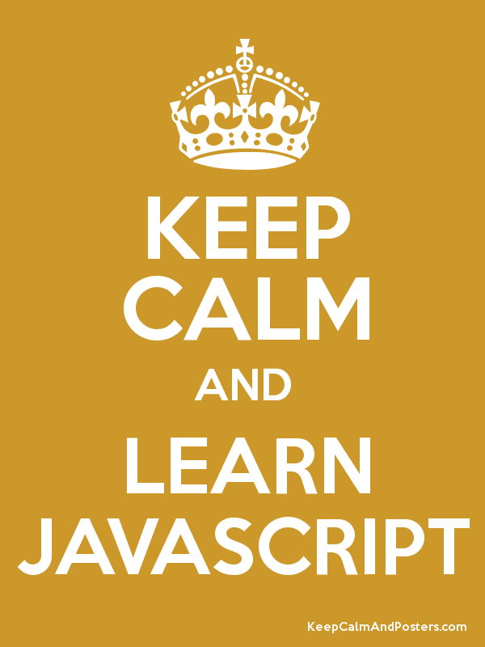

## First Reaction

Ever since I first started coding I have always been frustrated by " the rules". Java, C, and C++ are great languages for teaching "the rules" because each of them has specific ways and methods of doing things and also of not letting you do things that you want to do but "aren't allowed". I always thought that there must be an easier way to make computers do what you want. Even after growing to like coding, I was still bothered by the difficulty of coding and the frustration of "the rules". Well, I have found a solution to my dilemma. Enter JavaScript. My first takeaway was "Huh, pretty similar to Java, C, C++, and so on". Then the reality sank in. "Wow, I can do that? Java doesn't let me do that!" Needless to say, I think I'm hooked. 

## Flexibility and Siplicity

I am only a novice with JavaScript right now, but I can already see the vast benefits that this language offers over the other languages I have learned. For instace, the simplicity of JavaScript and the ease with which variables and arrays can be created. "What? I can create a variable without specifying a specific data type?" The code in JavaScript seems so much "easier" to read and understand in comparison to other languages as well. While working through the introductory tutorials for JavaScript I was routinely surprised by the ease and flexibility of the language. Arrays, which used to be one of the things I hated dealing with are so easy and intuitive to work with now. Simply put things in the array and you don't have to worry about what data type it is and whether or not you're mixing data types in the same array - it's all legal!

## Working it Out

Now this amazing new world of JavaScript isn't any good unless it is harnessed to produce something. Well, "Athletic Software Engineering", the style of teaching used in my software engineering class, does just that. Similar to how a person must focus on working-out in order to get fit, "Athletic Software Engineering" takes all these new things and forces students like me to focus and think. Consequently, we become better programmers and more effective computer scientists. Basically, the way "Athletic Software Engineering" works is during the week students complete practice WODs (Workout of the Day) in order to prepare for the graded WOD once a week. The WOD (Workout of the Day) and the practice WOD's force students to "work-out" on computer science stuff during the week in order to perform better when it actually matters - in class. I personally think this is a good way to learn, since everything in life requires practice in order to get good at it. Consequently, practicing coding skills can only help students to get better at coding.

## Looking Forward

I am still relatively new to computer science, being only a junior in college. However, I am looking forward to to what I still have to learn. Life is a constant learning process and JavaScript is just one part of that process. While I enjoy JavaScript (in fact, I love it right now), I am still looking beyond to new languages and new skills which I hope to acquire and use in my computer science career.

