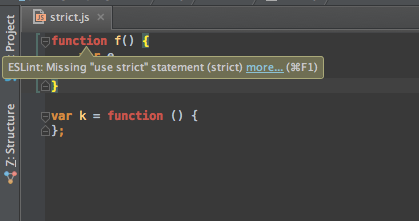

## What’s the Point?

When I first started out programming, I originally thought “Who cares whether or not there’s a space between the plus sign and the variables? What does it matter if my code is properly formatted?” Particularly when it came to commenting my code, I felt as if following coding standards was a waste of time. However, as I progressed into more advanced programming, I became more and more focused on the readability of my code. Once I realized the importance of clarity and efficiency in coding, I developed my ability to write my code more clearly, but I still didn’t follow any specific coding standard.

## Coding Standards Actually Help

It wasn’t until I took my first software engineering class that I really grasped the benefits of coding standards. One of the amazing new things I discovered during my early experience with JavaScript was ESLint, an add-on for IntelliJ IDEA that helps programmers to ensure that their code follows the Air Bnb Style Guide for JavaScript. Like many other Integrated Development Environments (IDE’s), IntelliJ  when combined with ESLint enables a programmer to easily spot errors in their code and fix them more efficiently and effectively. ESLint does this by highlighting errors in red and the programmer can then click on those highlights to find more details about the error. Once all the errors are fixed, ESLint then displays a green check mark to notify the user that all problems are corrected. This is one of the things I like about ESLint. The details about the error enable me to quickly define/solve the problem and I love the rewarding feeling when I finally get a green check on my code! It may seem trivial, but that green check represents the fact that I took the time and effort to make sure my code is readable and meets the coding standards. In the long run, especially in the professional world of computer science, that matters.

## The How Versus the What

One of the awesome things about using ESLint is that it helps me to think about *how* to code not just *what* to code. What I mean by that is *how* you code is pretty much just as important as *what* you code. For example, if a programmer writes a really excellent program but doesn’t following coding standards and doesn’t make his or her code readable, then other programmers will have a more difficult time understanding the code and will waste time which could be more effectively used on other tasks. Coding standards helps to establish a standard that programmers can follow in order to be on the same page when reading and writing code. Now, I will be honest. Using ESLint does require extra time up-front, since programmers have to enable ESLint in IntelliJ IDEA and must take the time to fix all the errors. However, in the long run this is much more efficient and beneficial for the developer and others who will see the code. The biggest thing I have noticed since starting to use ESLint is how readable my code has become. Since I am following the coding standards, I can understand what is going on in a program more easily and I am alerted by ESLint to any errors I have made. In fact, I actually enjoy finding the errors ESLint alerts me of and then solving them in order to get that green check!

## Just Go for It!

So, maybe you’re on the fence with coding standards or are totally against following them. Either way, this is my challenge to you – just give it a try. Honestly, I wasn’t too sure about following coding standards before I began doing it, but now I actually enjoy it and I am starting to realize the benefits. In the long term, coding standards will make you a better programmer and will enable you to be more efficient. That’s the point anyway, isn't it? As software engineers we want to program efficiently so that we can finish a task and move on to the next one. Coding standards can enable us to do that. So, go for it and try using ESLint!
