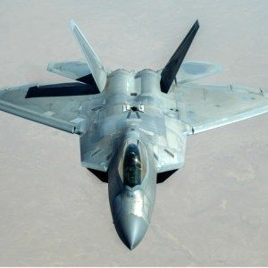

The objective of Olympic Jet Racing is for the player to win the race against the other jets which are assigned random speeds. The game was based on my idea of a hypothetical future jet racing event at the Olympics. Using the "A" and "S" keys, the player alternately presses each key to move forward. However, the player cannot simply hold the keys down. They must continue to alternately press each key in order to advance their fighter jet character across the screen. If the player reaches the finish line first, the program announces that they are the winner and awards them the title of "Ace". If the player does not reach the finish line before the other jets, they lose and the winning jet is announced as the winner. 

This game was written in Java using the Eclipse IDE. I developed all the code myself, although I received some gudidance and advice fro classmates and teaching assistants. Toe goal for the project was for students to learn how to use various loops and implement user input to create a simple racing game. It was the first computer science project which I had to create, so it seemed like a daunting task at first. It was certainly frustrating at times, since I had almost zero prior coding experience. However, I broke it up into different parts and set goals for myself to achieve certain objectives so that my program would be finished on time. The biggest lesson I learned from this project is the importance of asking for guidance when you need it and not being afraid to ask questions. 

You can watch a video of the gameplay at: [Olympic Jet Racing](https://www.youtube.com/watch?v=DhCaEseC1ks).

